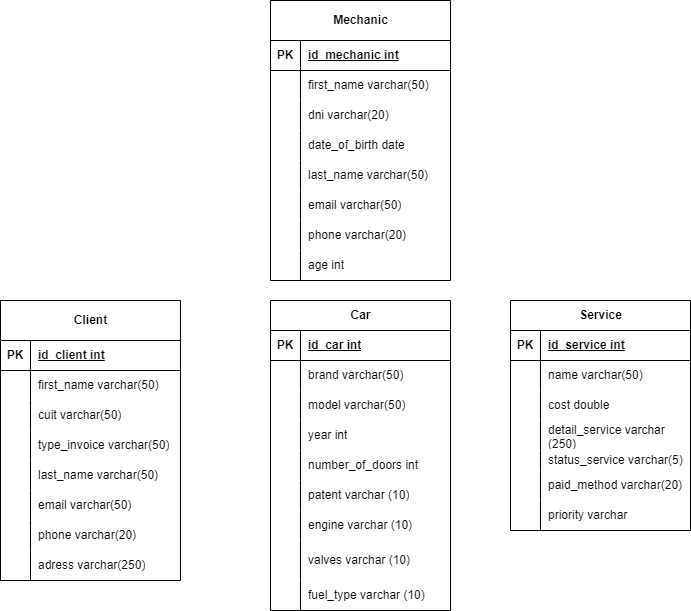

🛠️ Mechanical Workshop
Mechanical Workshop is a RESTful API developed for managing a mechanical workshop. It allows you to manage mechanics, clients, cars, and services offered by the workshop, providing full CRUD operations for each entity.

🚀 Available Endpoints
The API includes the following entities, each with its own set of endpoints:

🔧 Mechanical
GET /api/mechanics – Get all mechanics

GET /api/get_mechanic/<int:id> – Get a mechanic by ID

POST /api/add_mechanic – Create a new mechanic

PUT /api/edit_mechanic/<int:id> – Update a mechanic by ID

PATCH /api/update_mechanic/<int:id> – Partially update a mechanic

DELETE /api/delete_mechanic/<int:id> – Delete a mechanic

🚗 Car
GET /api/cars – Get all cars

GET /api/get_car/<int:id> – Get a car by ID

POST /api/add_car – Create a new car

PUT /api/edit_car/<int:id> – Update a car by ID

PATCH /api/update_car/<int:id> – Partially update a car

DELETE /api/delete_car/<int:id> – Delete a car

👤 Client
GET /api/clients – Get all clients

GET /api/get_client/<int:id> – Get a client by ID

POST /clients – Create a new client

PUT /api/up_client/<int:id> – Update a client by ID

PATCH /api/update_client/<int:id> – Partially update a client

DELETE /api/del_client/<int:id> – Delete a client

🧾 Service
GET /services – Get all services

GET /services/<id> – Get a service by ID

POST /services – Create a new service

PUT /services/<id> – Update a service by ID

PATCH /services/<id> – Partially update a service

DELETE /services/<id> – Delete a service

## 🧩 Class Diagram

📄 Documentation
You can access the full documentation and test the endpoints via the following Postman link:
👉 Postman collection link

🧑‍💻 Team Members
Ruben Ledesma

Rodrigo Espinosa

Santiago Romano

Santiago Puebla

🛠️ Technologies and Tools Used
Python 🐍

Flask 🔥

MySQL 🐬

MySQL Workbench 🧰

Git & GitHub 🔧

Postman 📬
